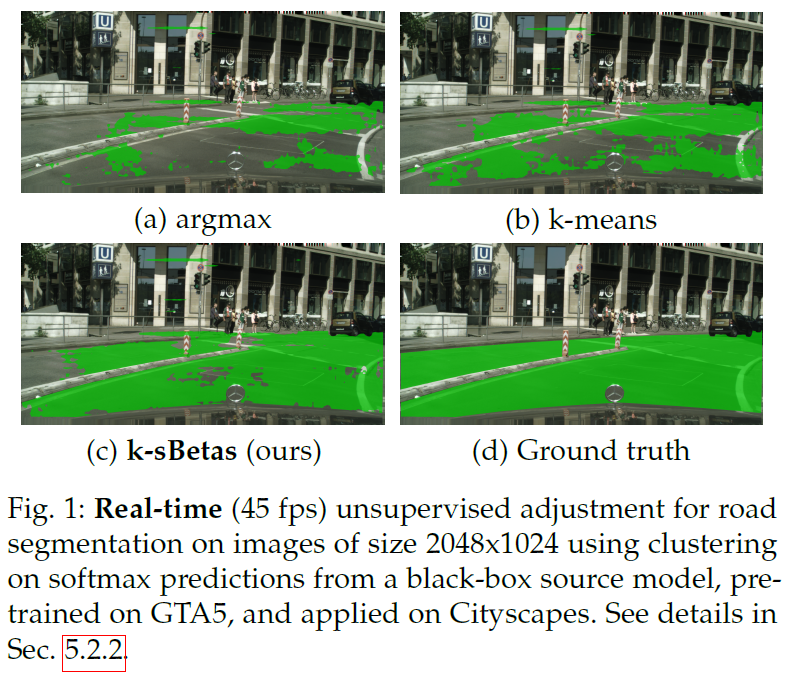

# Clustering Softmax Predictions

## Updates

## Paper
### [**Simplex Clustering via sBeta with Applications to Online Adjustment of Black-Box Predictions**](https://arxiv.org/pdf/2208.00287.pdf)

If you find this code useful for your research, please cite our [paper](https://arxiv.org/pdf/2208.00287.pdf):
```
@article{ch2022sc,
  title={Simplex Clustering via sBeta with Applications to Online Adjustments of Black-Box Predictions},
  author={Chiaroni, Florent and Boudiaf, Malik and Mitiche, Amar and Ben Ayed, Ismail},
  journal={arXiv preprint arXiv:2208.00287},
  year={2022}
}
```

## Abstract
<p align="justify">
  We explore clustering the softmax predictions of deep neural networks and introduce a novel probabilistic clustering method, referred to as k-sBetas. In the general context of clustering distributions, the existing methods focused on exploring distortion measures tailored to simplex data, such as the KL divergence, as alternatives to the standard Euclidean distance. We provide a general perspective of clustering distributions, which emphasizes that the statistical models underlying distortion-based methods may not be descriptive enough. Instead, we optimize a mixed-variable objective measuring the conformity of data within each cluster to the introduced sBeta density function, whose parameters are constrained and estimated jointly with binary assignment variables.
Our versatile formulation approximates a variety of parametric densities for modeling cluster data, and enables to control the cluster-balance bias. This yields competitive performances for efficient unsupervised adjustment of black-box predictions in a variety of scenarios, including one-shot classification and unsupervised domain adaptation in real-time for road segmentation.
</p>
<p align="center">
  
</p>

### Pre-requisites
* Python 3.9.4
* numpy 1.20.1
* scikit-learn 0.24.1
* scikit-learn-extra 0.2.0 (for k-medoids only)
* Pytorch 1.10.0 (for GPU-based k-sBetas only)
* CUDA 11.4 (for GPU-based k-sBetas only)

### Datasets
The comparisons are performed on the following datasets:
- Artificial datasets on the probability simplex domain
  - Simu
  - iSimus
- Real-world softmax predictions ([`softmax_preds_datasets/`](./softmax_preds_datasets))
  - SVHN -> MNIST ([`SVHN_to_MNIST/`](./softmax_preds_datasets/SVHN_to_MNIST))
  - VISDA-C ([`VISDA_C/`](./softmax_preds_datasets/VISDA_C))
  - iVISDA-Cs ([`sVISDA_Cs/`](./softmax_preds_datasets/iVISDA_Cs))

Note that we used the source models implemented in this code https://github.com/tim-learn/SHOT to generate these real-world softmax prediction datasets.

### Implemented clustering models
The script compare_softmax_preds_clustering.py compares the following clustering alogithms:
- k-means
- GMM (scikit-learn)
- k-medians
- k-medoids
- k-modes
- KL k-means
- HSC (Hilbert Simplex Clustering)
- k-Dirs (pip install git+https://github.com/ericsuh/dirichlet.git)
- k-sBetas (proposed)

### Running the code
Compare clustering approaches by executing:
```bash
$ cd <root_dir>
$ python compare_softmax_preds_clustering.py --dataset SVHN_to_MNIST % Comparison on SVHN to MNIST dataset
$ python compare_softmax_preds_clustering.py --dataset VISDA_C % Comparison on VISDA-C dataset
$ python compare_softmax_preds_clustering.py --dataset iVISDA_Cs % Comparison on highly imbalanced iVISDA-Cs datasets
```

### Recommandations
- The most appropriate value for the "delta" parameter of k-sBetas may change depending on the datasets distributions. We recommand to select delta using a validation set.
- On small-scale datasets, the biased formulation for k-sBetas could be more stable.
- On large-scale imbalanced datasets, the unbiased formulation provides better results.
